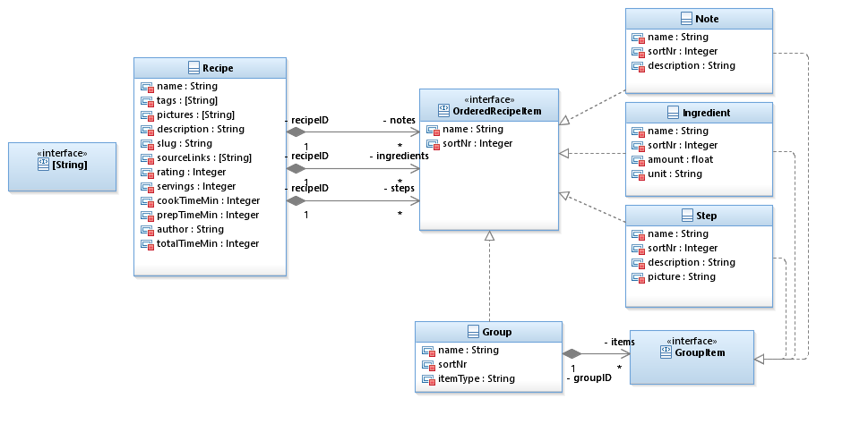

# Kuuk-Server
<p align="center">
    <a href="https://github.com/Taiwar/kuuk_server/contributors">
        
    </a>
</p>
Recipe management.

## Project documentation



## Getting Started

Installing dependencies:

```bash
npm install
```

Running the dev server:

```bash
npm run dev
```

Generate `graphql.ts` typing file from GraphQL files and watch for further changes:

```bash
npn run watch:typings
```

## Running in production

Serving the build
```bash
npm run start:prod
```

## Author(s)

* **Taiwar (Jonas)** - [Taiwar](https://github.com/Taiwar)
